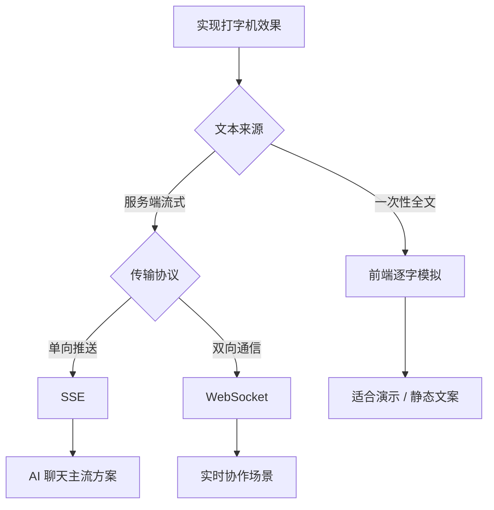
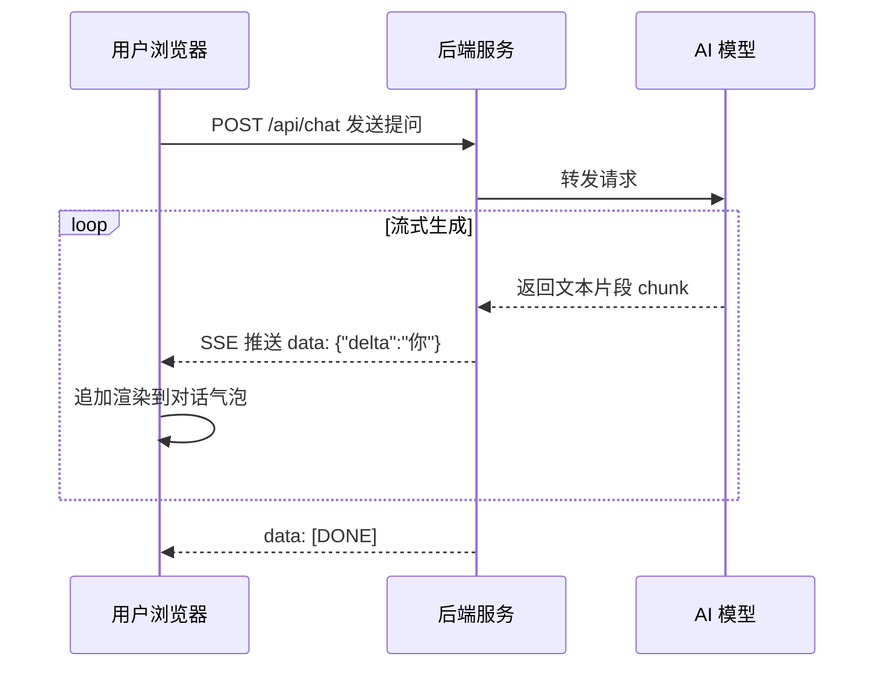
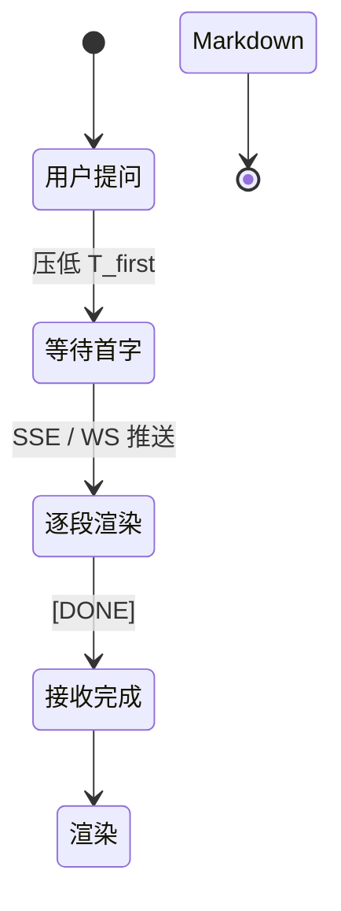

## 📖 引言

用过 ChatGPT 的人都会对那个**逐字蹦出**的回复记忆深刻。打字机效果看似只是"花哨的动画"，实际上承担着重要的**体验与产品**职责：

- **缩短感知等待**：首字出现后，用户的等待焦虑大幅降低
- **建立"思考中"的心智**：暗示模型正在实时生成
- **提升真实感**：模拟真人打字，拉近对话距离

本文将从前端视角出发，拆解打字机效果从"一次性文本的本地模拟"到"真正流式输出"的完整实现路径。



---

## 一、方式一：前端逐字模拟

当**全文已在客户端**（例如预生成的文案、静态问答库）时，不需要网络流式，直接在本地按节奏逐个字符渲染即可。

### 1.1 最简单的 setInterval 实现

```js
function typeWriter(el, fullText, speed = 30) {
	let index = 0;
	const timer = setInterval(() => {
		el.textContent = fullText.slice(0, ++index);
		if (index >= fullText.length) clearInterval(timer);
	}, speed);
}

typeWriter(document.querySelector("#answer"), "你好，我是 AI 助手！");
```

### 1.2 让速度更自然：变速打字

人类打字不是匀速的，在标点处稍作停顿会更自然：

```js
function typeWriter(el, fullText) {
	let index = 0;

	const tick = () => {
		const ch = fullText[index];
		el.textContent = fullText.slice(0, ++index);
		if (index >= fullText.length) return;

		// 标点后多停顿一会儿
		const delay = /[。！？，,.!?]/.test(ch) ? 180 : 30;
		setTimeout(tick, delay);
	};

	tick();
}
```

> [!TIP] 建议
> 优先使用 `setTimeout` 递归而非 `setInterval`，能更精确地控制每次间隔，也便于随时停止。

### 1.3 可停止与重置

结合闭包暴露控制接口：

```js
function createTyper(el) {
	let timer = null;

	return {
		start(fullText, speed = 30) {
			let index = 0;
			const tick = () => {
				el.textContent = fullText.slice(0, ++index);
				if (index >= fullText.length) return;
				timer = setTimeout(tick, speed);
			};
			tick();
		},
		stop() {
			clearTimeout(timer);
		},
	};
}
```

---

## 二、方式二：SSE 流式输出（AI 场景主流）

真实的大模型应用里，文本由服务端**边生成边返回**，前端必须能"来一段渲染一段"。**SSE（Server-Sent Events）** 是其中最简单、最主流的方案：一条 HTTP 长连接，服务端持续推送 `data:` 事件。



### 2.1 后端：搭建一个 SSE 接口（Node.js）

```js
// server.mjs
import express from "express";

const app = express();
app.use(express.json());

const sleep = (ms) => new Promise((resolve) => setTimeout(resolve, ms));

app.post("/api/chat", async (req, res) => {
	// SSE 必需的响应头
	res.setHeader("Content-Type", "text/event-stream");
	res.setHeader("Cache-Control", "no-cache");
	res.setHeader("Connection", "keep-alive");

	const reply = "你好！我是 AI 助手，很高兴认识你。";

	for (const ch of reply) {
		// 每个事件以 data: 开头，以空行 \n\n 结束
		res.write(`data: ${JSON.stringify({ delta: ch })}\n\n`);
		await sleep(30); // 模拟模型逐字生成
	}

	res.write("data: [DONE]\n\n");
	res.end();
});

app.listen(3000);
```

### 2.2 前端：用 fetch 读取流

`fetch` 返回的 `res.body` 是一个 **ReadableStream**，可以边读边解析 SSE：

```js
async function streamChat(prompt) {
	const controller = new AbortController();

	const res = await fetch("/api/chat", {
		method: "POST",
		headers: { "Content-Type": "application/json" },
		body: JSON.stringify({ prompt }),
		signal: controller.signal,
	});

	const reader = res.body.getReader();
	const decoder = new TextDecoder();
	let buffer = "";

	while (true) {
		const { value, done } = await reader.read();
		if (done) break;

		// 流式解码，正确处理跨 chunk 的多字节字符
		buffer += decoder.decode(value, { stream: true });

		// SSE 事件以空行分隔，逐个取出完整事件
		const events = buffer.split("\n\n");
		buffer = events.pop(); // 最后一段可能不完整，留到下次

		for (const event of events) {
			const dataLine = event
				.split("\n")
				.find((line) => line.startsWith("data:"));
			if (!dataLine) continue;

			const payload = dataLine.slice(5).trim();
			if (payload === "[DONE]") return;

			const { delta } = JSON.parse(payload);
			appendText(delta); // 收到一段，立即追加渲染
		}
	}
}
```

### 2.3 中断请求

用户可能想随时"停止生成"，用 `AbortController` 即可：

```js
const controller = new AbortController();

// 点击"停止"按钮
stopBtn.onclick = () => controller.abort();
```

> [!IMPORTANT] 重要
> 流式解码时一定要用 `TextDecoder(..., { stream: true })`，否则中文字符的 UTF-8 字节可能被拆到两个 chunk 里导致乱码。上面的代码已经正确处理了这一点。

---

## 三、方式三：WebSocket 流式

当需要**双向**持续通信（例如用户也要流式上传语音、或需要服务端主动推送状态）时，WebSocket 更合适。

```js
const ws = new WebSocket("wss://example.com/chat");

ws.onmessage = (event) => {
	const data = JSON.parse(event.data);

	if (data.type === "delta") {
		appendText(data.delta);
	} else if (data.type === "done") {
		markComplete();
	}
};

function send(prompt) {
	ws.send(JSON.stringify({ type: "chat", prompt }));
}
```

相比 SSE，WebSocket 需要自行处理**断线重连**、心跳与消息协议，复杂度更高；但对低延迟双向场景是更好的选择。

---

## 四、与 Markdown 渲染结合

AI 回复通常包含 Markdown（代码块、列表、加粗等）。**流式过程中逐字渲染 Markdown 会导致闪烁和重排**，业界通用的策略是：

1. **流式期间**：显示纯文本（或简单处理行内代码/换行）
2. **接收完成后**：一次性把完整文本交给 Markdown 渲染器

```js
if (payload === "[DONE]") {
	bubble.innerHTML = renderMarkdown(fullText); // 一次成型
} else {
	bubble.textContent = fullText; // 流式时只显示纯文本
}
```

> [!TIP] 建议
> 若想在流式过程中就显示代码高亮，可以只对"已经完整闭合"的代码块做渲染，其余保持纯文本，避免每一帧都重新解析整个文档。

---

## 五、体验细节与性能优化

### 5.1 光标闪烁

用 CSS 的 `::after` 伪元素模拟打字光标，避免额外 DOM 节点：

```css
.typing::after {
	content: "";
	display: inline-block;
	width: 2px;
	height: 1em;
	margin-left: 2px;
	background: currentColor;
	animation: blink 0.8s steps(1) infinite;
}

@keyframes blink {
	50% {
		opacity: 0;
	}
}
```

### 5.2 自动滚动

对话长度超过容器时，需要跟随内容自动滚动到底部：

```js
function autoScroll() {
	container.scrollTo({
		top: container.scrollHeight,
		behavior: "smooth",
	});
}
```

### 5.3 避免频繁回流

逐字写 `textContent` 本身开销很小，但若每帧都触发滚动、布局计算，仍可能卡顿。高频场景可用 `requestAnimationFrame` 做批量提交：

```js
let pending = "";
let rafId = null;

function appendText(delta) {
	pending += delta;
	if (rafId == null) {
		rafId = requestAnimationFrame(() => {
			bubble.textContent += pending;
			pending = "";
			rafId = null;
			autoScroll();
		});
	}
}
```

### 5.4 感知等待的量化

总耗时由**首字延迟**与**逐字间隔**共同决定：

$$
T_{\text{total}} = T_{\text{first}} + n \times \Delta t
$$

其中 $n$ 为字符/token 数，$\Delta t$ 为单个间隔。优化方向很清晰：尽量**压低 $T_{\text{first}}$**（更快流出第一个字），而非盲目减小 $\Delta t$。

---

## 六、三种方式怎么选

| 方式 | 数据来源 | 优点 | 缺点 | 适用场景 |
| --- | --- | --- | --- | --- |
| 前端模拟 | 一次性全文 | 实现最简单 | 首屏要等全文 | 文案演示、静态问答 |
| SSE | 服务端单向推送 | 协议简单、自动重连、HTTP 兼容 | 仅单向 | **AI 聊天主流** |
| WebSocket | 双向流 | 低延迟、可双向 | 需自行处理重连/心跳 | 实时协作、语音交互 |

> [!WARNING] 警告
> SSE 基于 HTTP，普通浏览器对**同域名并发连接数有限制**（HTTP/1.1 下约 6 个）。高并发场景请使用 HTTP/2 或评估 WebSocket。

---

## 七、总结



实现一个优秀的 AI 打字机效果，核心要点可以概括为：

1. **数据源决定方案**：一次性文本用前端模拟，流式文本用 SSE/WebSocket
2. **流式读取要正确解码**：`TextDecoder({ stream: true })` 避免中文乱码
3. **Markdown 后置渲染**：流式显示纯文本，完成后一次成型
4. **体验细节**：光标闪烁、自动滚动、可中断、批量提交

打字机效果不只是"动画"，它是 AI 应用里连接"生成中"与"已完成"的关键体验桥梁。
