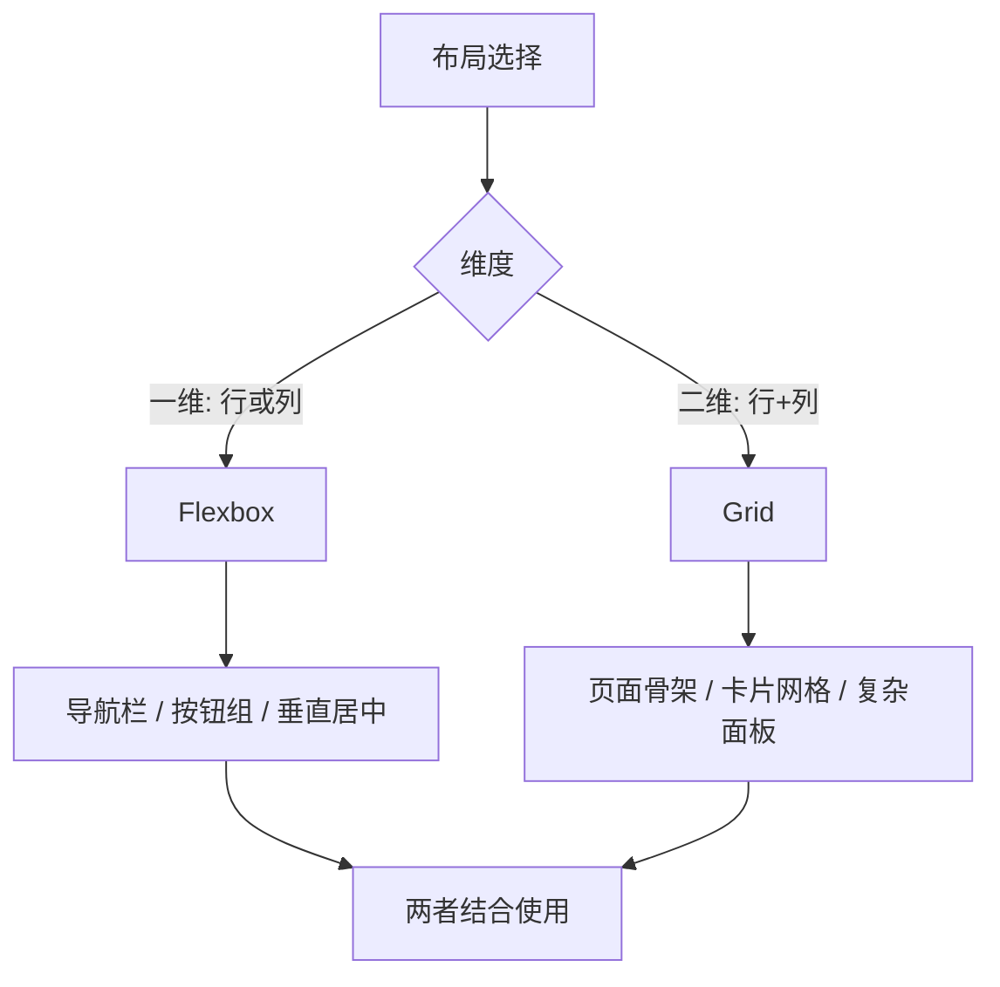
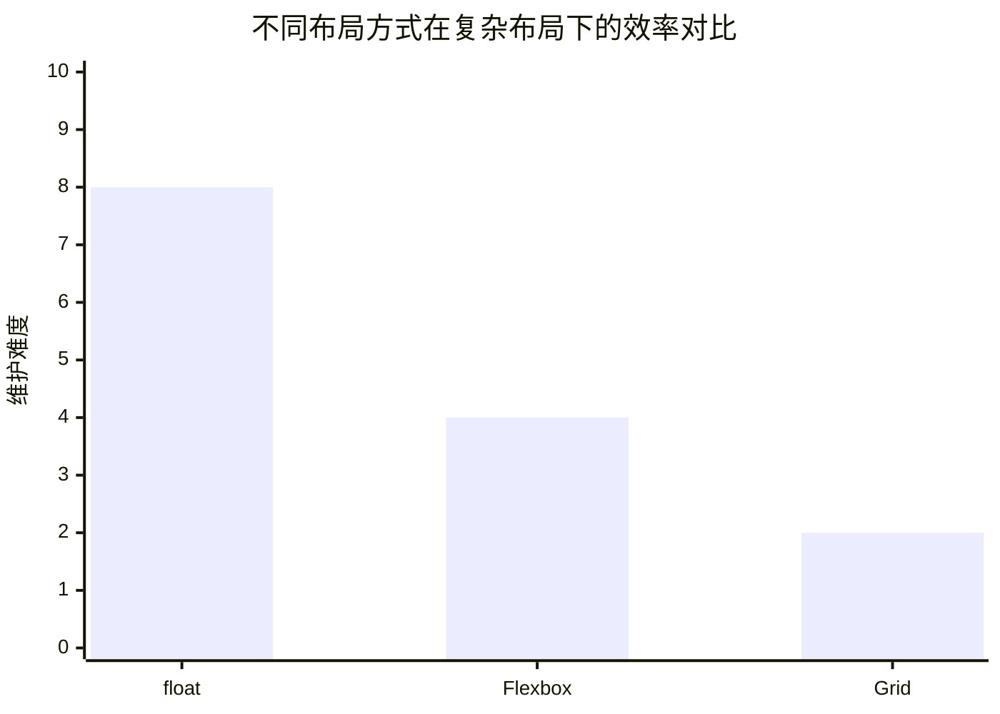

## 📖 引言

现代前端布局已经彻底告别了 `float` + `position` 堆叠的时代。**Flexbox** 与 **CSS Grid** 分别解决了一维与二维布局问题，二者相辅相成，是构建任何响应式界面都绕不开的基础能力。

本文将从核心概念出发，通过实战案例带你吃透这两种布局方式，并给出选择与组合的最佳实践。



---

## 一、Flexbox：一维布局

Flexbox 的核心思想是让容器内的项目沿**主轴**（main axis）与**交叉轴**（cross axis）自动排列与伸缩。

### 1.1 核心概念

- `display: flex`：建立弹性容器
- `flex-direction`：主轴方向（`row` / `column`）
- `justify-content`：主轴上的对齐
- `align-items`：交叉轴上的对齐
- `flex-grow` / `flex-shrink` / `flex-basis`：项目的伸缩规则

### 1.2 经典案例：垂直水平居中

```css
.center {
	display: flex;
	justify-content: center;
	align-items: center;
	height: 100vh;
}
```

### 1.3 经典案例：等分布局

```css
.nav {
	display: flex;
	gap: 8px;
}

.nav .item {
	flex: 1; /* 等价于 flex: 1 1 0% */
	text-align: center;
}
```

`flex: 1` 让所有项目均分剩余空间，`gap` 则优雅地处理项目间距，无需再为 margin 做负值修正。

> [!TIP] 建议
> 现代浏览器已全面支持 `gap` 在 Flex 容器中使用（2021 年后）。它比 margin 方案更简洁，且不会影响首尾间距。

---

## 二、Grid：二维布局

Grid 将容器划分为**行**（rows）与**列**（columns），项目可以精确放置到任意单元格，甚至跨行跨列。

### 2.1 核心概念

- `display: grid`：建立网格容器
- `grid-template-columns` / `grid-template-rows`：定义轨道
- `grid-template-areas`：用命名区域描述布局
- `grid-column` / `grid-row`：项目定位
- `fr` 单位：按比例分配剩余空间

### 2.2 经典案例：响应式卡片网格

```css
.cards {
	display: grid;
	grid-template-columns: repeat(auto-fill, minmax(240px, 1fr));
	gap: 16px;
}

.card {
	background: var(--surface);
	border-radius: 12px;
	padding: 16px;
}
```

`auto-fill` + `minmax(240px, 1fr)` 组合实现了**无需媒体查询**的自适应列数：容器越宽，列数越多。

### 2.3 经典案例：grid-template-areas 页面骨架

```css
.layout {
	display: grid;
	grid-template-columns: 220px 1fr;
	grid-template-rows: auto 1fr auto;
	grid-template-areas:
		"sidebar header"
		"sidebar main"
		"sidebar footer";
	min-height: 100vh;
}

.header { grid-area: header; }
.sidebar { grid-area: sidebar; }
.main { grid-area: main; }
.footer { grid-area: footer; }
```

这种写法让布局结构在 CSS 中"一目了然"，非常适合页面级骨架。

---

## 三、Flexbox vs Grid：如何选择

| 维度 | Flexbox | Grid |
| --- | --- | --- |
| 布局方向 | 一维（单方向） | 二维（行列同时） |
| 内容驱动 | 内容决定尺寸，可伸缩 | 轨道决定尺寸，可跨单元 |
| 典型场景 | 导航、按钮组、对齐 | 页面骨架、卡片网格 |
| 交叉轴对齐 | 单行/单列内对齐 | 行与列可独立控制 |
| 学习曲线 | 较低 | 略高但更强大 |

> [!NOTE] 提示
> 二者不是对立关系，而是互补关系。业界常见的模式是：**页面级布局用 Grid，组件内部布局用 Flexbox**。

---

## 四、实战：从零搭建一个博客头部

综合运用两种布局，实现一个包含 Logo、导航、搜索按钮和头像的博客头部：

```html
<header class="header">
	<a class="brand" href="/">🪄 My Blog</a>
	<nav class="nav">
		<a href="/posts">文章</a>
		<a href="/tags">标签</a>
		<a href="/about">关于</a>
	</nav>
	<div class="actions">
		<button class="search">🔍</button>
		
	</div>
</header>
```

```css
.header {
	display: grid;
	grid-template-columns: auto 1fr auto; /* 三栏: 品牌 / 导航 / 操作区 */
	align-items: center;
	padding: 0 24px;
	height: 64px;
}

.nav {
	display: flex;
	justify-content: center;
	gap: 24px;
}

.actions {
	display: flex;
	align-items: center;
	gap: 12px;
}
```

**思路拆解**：头部整体是一个横向三栏结构，用 Grid 划分；而导航与操作区内部是并列元素，用 Flexbox 排列。两种布局各司其职，代码清晰且易于维护。

---

## 五、响应式进阶：移动端适配

使用媒体查询在窄屏下切换布局策略：

```css
@media (max-width: 768px) {
	.header {
		grid-template-columns: 1fr;
		grid-template-areas:
			"brand"
			"nav"
			"actions";
	}

	.nav {
		flex-wrap: wrap;
		justify-content: flex-start;
	}
}
```

小屏设备上纵向堆叠，大屏设备上横向展开——这正是 Grid 与 Flexbox 协作的典型模式。

---

## 六、总结



布局能力演进：`float` → `Flexbox` → `Grid`，每一代都在降低复杂布局的实现成本。牢记以下要点：

1. **Flexbox 适合一维**：导航、工具栏、对齐、伸缩
2. **Grid 适合二维**：页面骨架、卡片网格、复杂面板
3. **`fr` 与 `minmax` 是响应式的利器**，减少媒体查询
4. **`gap` 统一管理间距**，告别 margin hack
5. **两者组合使用**，页面级 Grid + 组件级 Flexbox

> [!CAUTION] 注意
> `grid-template-areas` 的命名区域必须是矩形，无法表达 L 形或不规则布局；遇到复杂不规则的场景，可以退回 `grid-column` / `grid-row` 定位。

掌握好这两大布局工具，你就能从容应对绝大多数前端页面结构需求。
