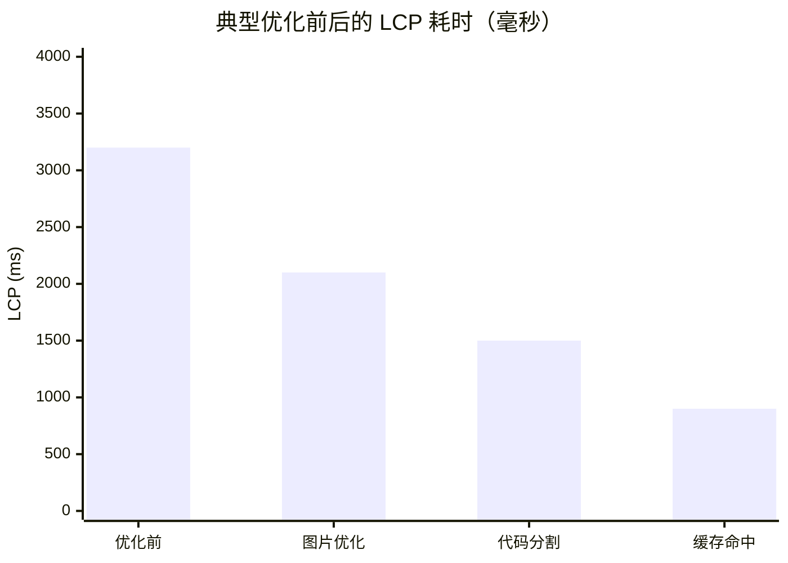
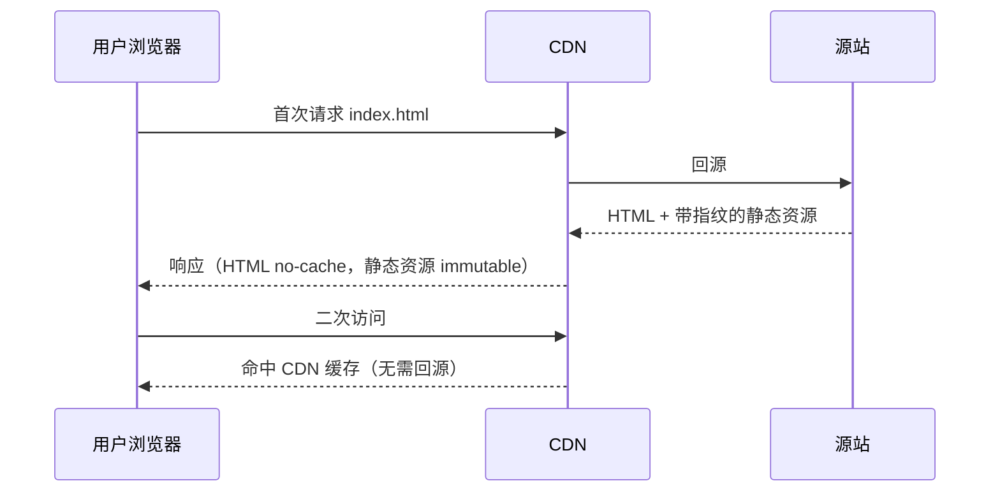

## 📖 引言

在移动优先的时代，**加载速度**直接决定用户体验与业务转化率。研究表明，页面加载时间每增加 1 秒，转化率平均下降约 7%。性能优化不是"锦上添花"，而是前端工程的基本功。

本文将围绕**测量 → 定位 → 优化 → 复测**的闭环，系统梳理高频且有效的优化手段。


---

## 一、核心指标：Web Vitals

性能优化的第一步是**量化现状**。Google 推荐关注三大 Core Web Vitals：

| 指标 | 含义 | 良好阈值 |
| --- | --- | --- |
| **LCP**（Largest Contentful Paint） | 最大内容绘制，感知加载速度 | ≤ 2.5s |
| **INP**（Interaction to Next Paint） | 交互响应延迟 | ≤ 200ms |
| **CLS**（Cumulative Layout Shift） | 累计布局偏移，视觉稳定性 | ≤ 0.1 |



> [!IMPORTANT] 重要
> 指标不是终点，而是定位工具。LCP 高通常指向资源加载慢；INP 高指向 JS 长时间占用主线程；CLS 高指向布局抖动（如图片无尺寸、动态注入内容）。

---

## 二、图片优化：往往收益最大

图片常常占据页面总字节的 60% 以上，是最容易产生立竿见影效果的优化方向。

### 2.1 现代格式与压缩

- **WebP / AVIF**：同等质量下体积远小于 PNG/JPEG
- 采用**有损转码 + 目标尺寸**，避免"大图小用"

假设一张原始 PNG 为 800KB，转成 WebP 后约 120KB：

$$
\text{体积节省率} = \frac{800 - 120}{800} \times 100\% = 85\%
$$

仅此一步，图片总下载量即可下降一个数量级。

### 2.2 懒加载与占位

```html

```

- `loading="lazy"`：视口外的图片延迟加载
- `width` / `height` 显式声明：防止布局偏移（降低 CLS）
- 配合 **LQIP**（低质量占位图）或模糊占位，提升感知加载体验

### 2.3 响应式图片

```html

```

浏览器会根据视口宽度自动选择最合适的图片，避免移动端下载桌面级大图。

---

## 三、代码优化：分割与剪枝

### 3.1 代码分割（Code Splitting）

把首屏不需要的代码拆成独立 chunk，按需加载：

```js
// 动态导入：仅在点击时加载
const onOpen = async () => {
	const { Chart } = await import("./charts.js");
	new Chart("#main");
};
```

### 3.2 Tree Shaking

基于 ES Module 的静态分析，**移除未使用代码**。让打包器能"摇掉"无用分支，需要：

- 使用 ESM 语法（`import` / `export`）
- 避免副作用（sideEffects）干扰分析
- 优先导入具名导出而非整个库：

```js
// ✅ 只打包用到的函数
import { debounce } from "lodash-es";

// ❌ 可能引入整个库
import _ from "lodash";
```

### 3.3 减少主线程压力

- 大批量计算放入 **Web Worker** 或 `scheduler` API
- 长列表使用**虚拟滚动**（只渲染可视区域）
- 减少重渲染：组件细粒度拆分、记忆化（memo）

---

## 四、缓存策略：让二次访问飞起来



- **带内容指纹的文件名**（如 `app.8f3c2a.js`）：内容变化才换文件名，可设置长期缓存 `Cache-Control: public, max-age=31536000, immutable`
- **HTML 不缓存或短缓存**：保证新版本能及时下发
- 静态资源走 **CDN**，就近分发，降低网络延迟

---

## 五、渲染优化：从布局到合成

浏览器渲染流水线为：`解析 HTML → 构建 DOM/CSSOM → 布局 → 绘制 → 合成`。对动画而言，最好只触发**合成**阶段。

```css
/* ✅ 合成器属性：流畅的 60fps 动画 */
.animate {
	transform: translateX(100px);
	opacity: 0.5;
	will-change: transform;
}

/* ❌ 触发重排/重绘的属性 */
/* left, top, width, height 会触发 layout */
```

- 动画尽量使用 `transform` / `opacity`
- 减少强制同步布局（避免在循环中读 `offsetHeight` 再写样式）
- `content-visibility: auto` 跳过屏幕外内容的渲染

---

## 六、一个可落地的优化清单

1. 先用 Lighthouse / PageSpeed Insights **测量基线**
2. 图片转 WebP/AVIF + 响应式 + 懒加载
3. 代码分割首屏关键路径，开启 Tree Shaking
4. 静态资源加指纹 + CDN + 长期缓存
5. 动画改用合成器属性，消除 CLS
6. 复测对比，记录收益

> [!TIP] 建议
> 优化要有"投入产出比"意识：先解决占比最大的瓶颈（通常是图片与首屏 JS），再逐步精细化，避免在细枝末节上过度投入。

---

## 七、总结

性能优化是一个**持续迭代**的过程。掌握好测量指标、图片策略、代码分割与缓存这四板斧，就能覆盖绝大多数场景的优化诉求。记住：**先测量，再优化，最后用数据验证**。
