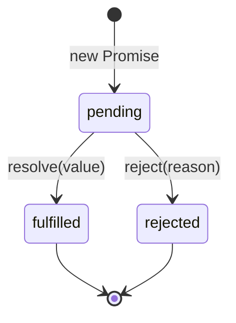
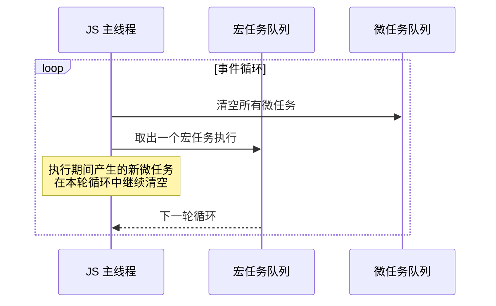
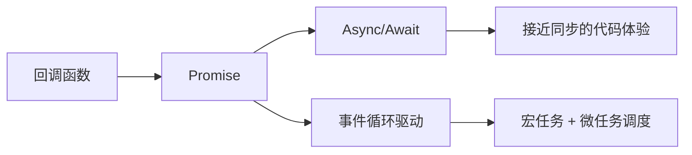

## 📖 引言

JavaScript 是**单线程**语言，却要处理网络请求、定时器、用户交互等大量耗时操作。异步编程因此成为前端开发的核心课题。从最早的回调函数，到 Promise，再到 async/await，语言的异步能力在不断增强，其背后的**事件循环**机制则始终未变。

本文会沿着这条演进路线，帮你彻底打通"异步"这道关卡。

---

## 一、为什么需要异步

同步代码会**阻塞**后续执行。假设我们要等待一个耗时的网络请求：

```js
// 同步风格的伪代码：阻塞 2 秒
const data = blockingFetch("/api/user");
console.log("这行要等 2 秒后才能执行");
```

浏览器的主线程既要渲染页面又要执行 JS，一旦被阻塞，页面就会卡死。因此 JS 采用**异步 + 回调**的方式：先发起任务，登记回调，等任务完成后由事件循环回头调用回调。

---

## 二、回调函数与回调地狱

```js
fetchUser(userId, (user) => {
	fetchPosts(user.id, (posts) => {
		fetchComments(posts[0].id, (comments) => {
			console.log(comments); // 层层嵌套
		});
	});
});
```

层层嵌套的回调不仅难以阅读，还会带来**错误处理分散**、**难以取消**、**控制流混乱**等问题，这就是经典的"回调地狱"。

---

## 三、Promise：异步的标准化

Promise 是一个表示**未来完成或失败**结果的对象，拥有三种状态：



### 3.1 基本用法

```js
const fetchUser = (id) => {
	return new Promise((resolve, reject) => {
		setTimeout(() => {
			if (id > 0) resolve({ id, name: "Alice" });
			else reject(new Error("无效 id"));
		}, 500);
	});
};

fetchUser(1)
	.then((user) => console.log(user))
	.catch((err) => console.error(err));
```

### 3.2 链式调用扁平化

```js
fetchUser(userId)
	.then((user) => fetchPosts(user.id))
	.then((posts) => fetchComments(posts[0].id))
	.then((comments) => console.log(comments))
	.catch((err) => console.error(err));
```

回调的"地狱"变成了清晰的"流水线"，错误也只需统一在末尾处理一次。

### 3.3 并发控制

- `Promise.all`：全部成功才成功（任一失败则失败）
- `Promise.allSettled`：等待所有完成，各自报告结果
- `Promise.race`：谁先完成用谁的结果
- `Promise.any`：第一个成功的结果

```js
const [users, posts] = await Promise.all([
	fetch("/api/users").then((r) => r.json()),
	fetch("/api/posts").then((r) => r.json()),
]);
```

---

## 四、事件循环：异步的底层引擎

JS 的异步任务被划分为**宏任务**（macrotask）与**微任务**（microtask），由事件循环统一调度：



**关键规则**：

1. 每轮事件循环先执行一个宏任务
2. 执行完该宏任务后，**清空整个微任务队列**
3. 再进行下一轮循环
4. 常见的微任务：`Promise.then`、`queueMicrotask`、`MutationObserver`
5. 常见的宏任务：`setTimeout`、`setInterval`、I/O、UI 渲染

```js
console.log("1"); // 同步

setTimeout(() => console.log("2")); // 宏任务

Promise.resolve().then(() => console.log("3")); // 微任务

console.log("4"); // 同步
// 输出顺序: 1 -> 4 -> 3 -> 2
```

> [!NOTE] 提示
> 微任务总是在"当前宏任务结束后、下一个宏任务开始前"被清空。因此 `Promise` 的回调会先于 `setTimeout` 执行。

---

## 五、Async/Await：用同步的写法写异步

`async` 函数总是返回一个 Promise；`await` 会暂停函数执行，直到右侧的 Promise 敲定。

```js
async function loadUserAndPosts() {
	const user = await fetchUser(userId);
	const posts = await fetchPosts(user.id);
	return posts;
}
```

它本质上是 Promise 链的**语法糖**，但可读性接近同步代码，并且可以直接使用 `try/catch` 捕获错误：

```js
try {
	const posts = await loadUserAndPosts();
	console.log(posts);
} catch (err) {
	console.error("加载失败:", err);
}
```

---

## 六、常见陷阱与最佳实践

### 6.1 不要在循环中 await（串行）

```js
// ❌ 逐个等待，非常慢
for (const id of ids) {
	const data = await fetchData(id);
	results.push(data);
}

// ✅ 并行发起，统一等待
const results = await Promise.all(ids.map((id) => fetchData(id)));
```

### 6.2 await 会吞掉异常吗？

不会，但要注意 `async` 函数内的异常会被转为 rejected Promise：

```js
async function risky() {
	throw new Error("boom");
}

// 必须 catch，否则会触发 unhandled rejection
risky().catch(console.error);
```

### 6.3 处理并发上限

当请求数量很大时，`Promise.all` 一次性全部发起可能压垮服务器，需要控制并发：

```js
async function mapLimit(items, limit, fn) {
	const results = [];
	const queue = [...items];
	const workers = Array.from({ length: limit }, async () => {
		while (queue.length) {
			const item = queue.shift();
			results.push(await fn(item));
		}
	});
	await Promise.all(workers);
	return results;
}
```

---

## 七、总结



| 阶段 | 核心能力 | 遗留问题 |
| --- | --- | --- |
| 回调 | 不阻塞的异步执行 | 回调地狱、错误分散 |
| Promise | 链式、状态化、可组合 | 链路过长时仍有噪音 |
| Async/Await | 同步式写法、try/catch | 需理解 await 语义 |

> [!WARNING] 警告
> `await` 会阻塞当前 `async` 函数体，但**不会阻塞主线程**。对无依赖的并发任务，务必使用 `Promise.all` 等方式并行，否则白白浪费时间。

理解了事件循环与微任务/宏任务的调度规则，再配合 Promise 与 async/await 的组合拳，你就能写出既高效又易读的异步代码。
