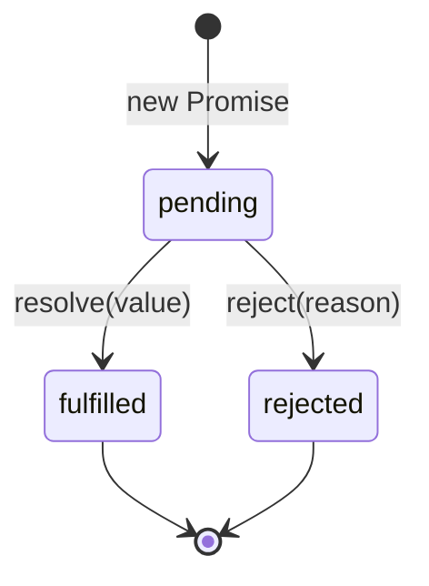
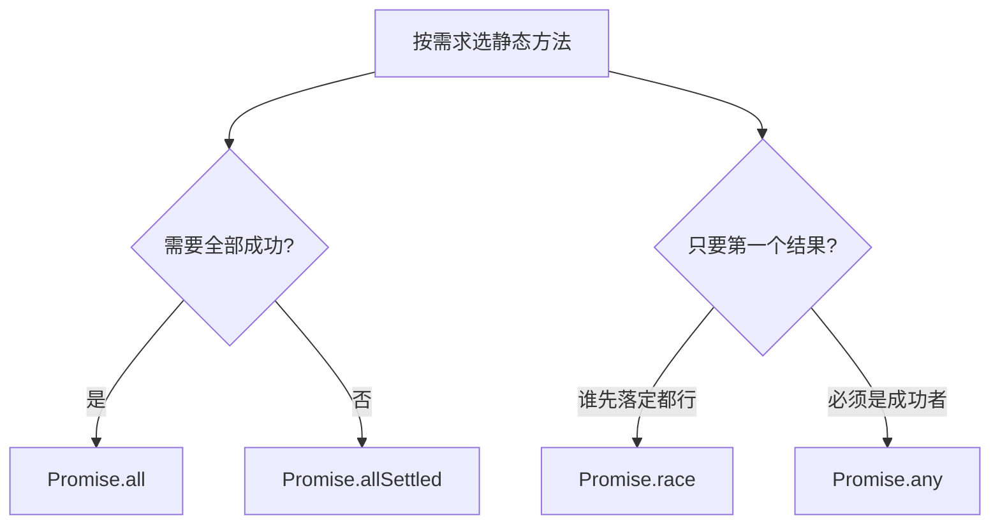

## 📖 引言

Promise 是现代 JavaScript 异步编程的基石。掌握它的**实例方法**（`then` / `catch` / `finally`）是基础，而真正拉开差距的，是理解四个静态方法（`all` / `allSettled` / `race` / `any`）之间微妙的**语义差异**，以及在真实项目中如何选型。

本文将从状态机出发，逐一定义每个方法的行为，再用可运行的场景示例说明"什么时候该用哪一个"。



---

## 一、实例方法：then / catch / finally

### 1.1 状态与实例方法

一个 Promise 只有三种状态，且**一经改变便不可逆**：

- `pending`（进行中）→ `fulfilled`（已成功）或 `rejected`（已失败）

```js
const p = new Promise((resolve, reject) => {
	// 成功时调用 resolve(value)
	// 失败时调用 reject(reason)
});
```

实例方法的核心是**链式传递**：

```js
fetch("/api/user")
	.then((res) => res.json()) // 处理成功
	.then((user) => render(user)) // 继续链式处理
	.catch((err) => showError(err)) // 统一捕获前面任何环节的失败
	.finally(() => stopLoading()); // 无论成败都执行
```

> [!NOTE] 提示
> `then` 可以同时接收第二个参数 `onRejected`，但更推荐用 `catch` 收尾——它能捕获**整条链上**任意一步抛出的错误。

### 1.2 错误传递规则

`then` / `catch` 中抛出异常或返回 rejected Promise，都会把错误**沿着链向下传递**，直到被某个 `catch` 接住：

```js
Promise.resolve(1)
	.then((n) => {
		throw new Error("出错了");
	})
	.then(() => console.log("不会执行"))
	.catch((err) => console.log("捕获:", err.message)); // 捕获: 出错了
```

---

## 二、静态方法速览

静态方法用于创建 Promise 或组合多个 Promise，先给出一张总览表：

| 方法 | 结果时机 | 失败语义 | 返回内容 |
| --- | --- | --- | --- |
| `Promise.resolve(v)` | 立即 | — | 已成功的 Promise |
| `Promise.reject(e)` | 立即 | 始终失败 | 已失败的 Promise |
| `Promise.all` | 全部成功 | 任一失败即失败 | 结果数组 |
| `Promise.allSettled` | 全部落定 | **永不失败** | 状态对象数组 |
| `Promise.race` | 首个落定 | 首个失败即失败 | 首个结果 |
| `Promise.any` | 首个成功 | 全部失败才失败 | 首个成功结果 |

---

## 三、Promise.resolve / Promise.reject

### 3.1 用法

```js
const ok = Promise.resolve(42); // 等价于 new Promise(r => r(42))
const bad = Promise.reject(new Error("boom"));
```

### 3.2 应用场景

- **把任意值包装成 Promise**：让"同步方法"与"异步方法"拥有统一的调用接口

```js
function getUser(id) {
	if (!id) return Promise.resolve(null); // 空值也走统一异步路径
	return fetch(`/api/user/${id}`).then((r) => r.json());
}
```

- **在测试 / Mock 中快速制造成功或失败的 Promise**，无需真实请求：

```js
const mockApi = () => Promise.resolve({ data: [] });
const mockFail = () => Promise.reject(new Error("mock 失败"));
```

---

## 四、Promise.all：全部成功才算成功

### 4.1 语义

`Promise.all` 接收一个可迭代对象，**全部 fulfilled** 后才进入成功回调；**只要有一个 rejected**，立即整体失败（fail-fast），并携带首个失败原因。

```js
const [users, posts, comments] = await Promise.all([
	fetch("/api/users").then((r) => r.json()),
	fetch("/api/posts").then((r) => r.json()),
	fetch("/api/comments").then((r) => r.json()),
]);
```

### 4.2 应用场景

- **并行发起相互独立的请求**，整体等待后再渲染，减少串行等待
- **初始化多个独立资源**（配置、权限、字典数据）后统一启动应用

> [!CAUTION] 注意
> `Promise.all` 是"快速失败"的：一个请求挂了，其余**已经在途**的请求结果会被丢弃，即使它们最终成功。若希望"部分成功也保留结果"，请看 `allSettled`。

---

## 五、Promise.allSettled：全部落定，各自报告

### 5.1 语义

等待**所有** Promise 落定（无论成败），返回一个状态对象数组，且**永远不 reject**：

```js
const results = await Promise.allSettled([p1, p2, p3]);
// [
//   { status: "fulfilled", value: ... },
//   { status: "rejected", reason: ... },
//   { status: "fulfilled", value: ... },
// ]
```

### 5.2 应用场景

- **批量任务：部分失败也要逐条上报**。例如批量保存多条记录，不能因为一条失败而丢掉其他结果：

```js
const saves = ids.map((id) => saveRecord(id));
const results = await Promise.allSettled(saves);

const failed = results
	.map((r, i) => (r.status === "rejected" ? { id: ids[i], reason: r.reason } : null))
	.filter(Boolean);

console.log(`成功 ${results.length - failed.length} 条，失败 ${failed.length} 条`);
```

- **日志上报 / 数据采集**：单个接口偶发失败不应阻塞整批数据
- **爬虫 / 健康检查**：逐个检查多个服务，汇总各自状态

> [!TIP] 建议
> 判断"是否需要全部成功"是选择 `all` 还是 `allSettled` 的核心标准：**强一致性用 all，容错收集用 allSettled**。

---

## 六、Promise.race：谁先落定用谁

### 6.1 语义

`Promise.race` 关注的是**第一个落定**（无论成功或失败）的结果——它像一场赛跑，第一个冲线者决定最终结果。

### 6.2 应用场景：超时控制

最常见的用法是给任意异步操作加超时：

```js
function withTimeout(promise, ms, timeoutMsg = "操作超时") {
	let timer;
	const timeout = new Promise((_, reject) => {
		timer = setTimeout(() => reject(new Error(timeoutMsg)), ms);
	});
	return Promise.race([promise, timeout]).finally(() => clearTimeout(timer));
}

// 3 秒内没返回就报超时
const data = await withTimeout(fetchData(), 3000);
```

> [!WARNING] 警告
> `Promise.race` 只是"结果竞争"，**并不会取消**落败的一方。例如用 `race` 做请求超时，底层请求仍在继续，只是其结果被忽略。需要真正取消请求时，配合 `AbortController` 使用。

---

## 七、Promise.any：首个成功者胜出

### 7.1 语义

`Promise.any` 等待**第一个 fulfilled** 的结果；只有**全部失败**时才 reject，且错误是一个 `AggregateError`（聚合所有失败原因）。

### 7.2 应用场景

- **多源容错：多个 CDN / 副本任选其一**，只要有一个可用即可：

```js
const sources = [
	"https://cdn-a.example.com/app.js",
	"https://cdn-b.example.com/app.js",
	"https://cdn-c.example.com/app.js",
];

async function loadBest() {
	const tries = sources.map((src) => fetch(src).then((r) => r.text()));
	const code = await Promise.any(tries);
	eval(code); // 用最先成功拉到的脚本
}
```

- **服务发现 / 就近选路**：多个后端实例返回同一结果，取最快成功的那个

> [!NOTE] 提示
> `race` 与 `any` 的区别就在"第一个**落定**" vs "第一个**成功**"。前者可能被一次快速的失败"抢跑"，后者则无视失败、只认成功。

---

## 八、综合实战：组合运用

### 8.1 手写并发限制（p-limit 思想）

真实场景中，同时发起几十个请求会压垮服务器。实现一个带并发上限的执行器：

```js
async function mapLimit(items, limit, fn) {
	const results = [];
	const queue = [...items];

	const workers = Array.from({ length: limit }, async () => {
		while (queue.length) {
			const item = queue.shift();
			results.push(await fn(item));
		}
	});

	await Promise.all(workers);
	return results;
}

// 每次最多并发 5 个请求
const data = await mapLimit(images, 5, (url) => fetch(url).then((r) => r.blob()));
```

假设任务总数为 $n$、并发上限为 $k$、单个任务耗时约 $T$，理想总耗时约为：

$$
T_{\text{total}} \approx \frac{n}{k} \times T
$$

并发上限 $k$ 越大越快，但也越容易触发服务端限流，需要权衡。

### 8.2 失败自动重试

结合 `Promise.race` 与递归实现带超时的重试：

```js
async function retry(fn, { retries = 3, delay = 500 } = {}) {
	for (let attempt = 1; ; attempt++) {
		try {
			return await fn();
		} catch (err) {
			if (attempt >= retries) throw err;
			await new Promise((r) => setTimeout(r, delay * attempt)); // 指数退避
		}
	}
}

const data = await retry(() => fetchData(), { retries: 3 });
```

### 8.3 顺序执行

需要**严格按顺序**处理（如逐条写入、防止竞态）时，用 `reduce` 串行：

```js
const steps = [taskA, taskB, taskC];
const result = await steps.reduce(
	(chain, task) => chain.then(task),
	Promise.resolve(),
);
```

---

## 九、四兄弟对比总结



| 场景 | 推荐方法 | 理由 |
| --- | --- | --- |
| 并行请求后整体渲染 | `all` | 任一失败则整体失败，fail-fast |
| 批量保存 / 采集，容忍部分失败 | `allSettled` | 永不 reject，逐条报告 |
| 给请求加超时 | `race` | 与超时 Promise 竞争 |
| 多 CDN / 多副本取最快可用 | `any` | 只认第一个成功者 |

> [!IMPORTANT] 重要
> 选错方法最常见的坑是：该用 `allSettled` 的地方用了 `all`，结果某一条数据失败导致整个页面白屏。判断口诀：**"一个失败要不要拖垮整体？要 → all，不要 → allSettled"**。

---

## 十、总结

Promise 的方法体系虽然不大，但语义精微。掌握它们的要点可以概括为：

1. **实例方法**：`then` 链式、`catch` 兜底、`finally` 收尾
2. **all**：全部成功，快速失败
3. **allSettled**：全部落定，永不失败
4. **race**：首个落定，适合超时
5. **any**：首个成功，适合容错
6. **组合**：并发限制、重试、串行，皆由它们搭出

理解这些方法的差异与边界，你就能在真实项目中从容地编排任何异步流程。
