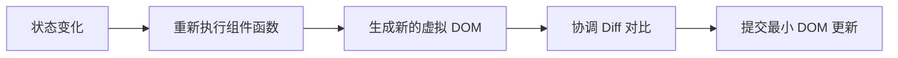
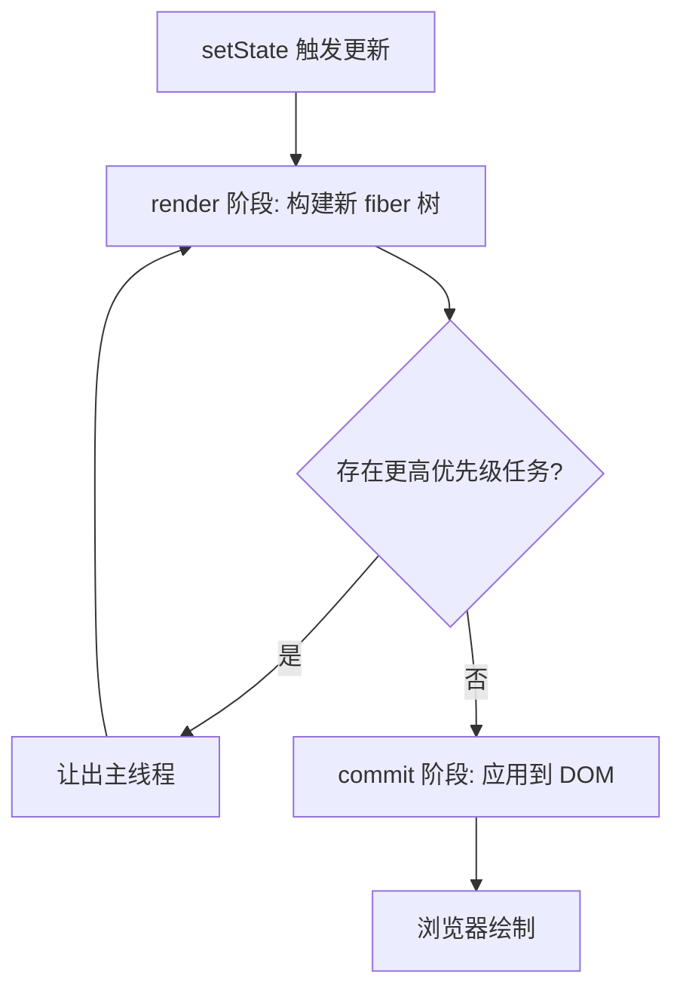
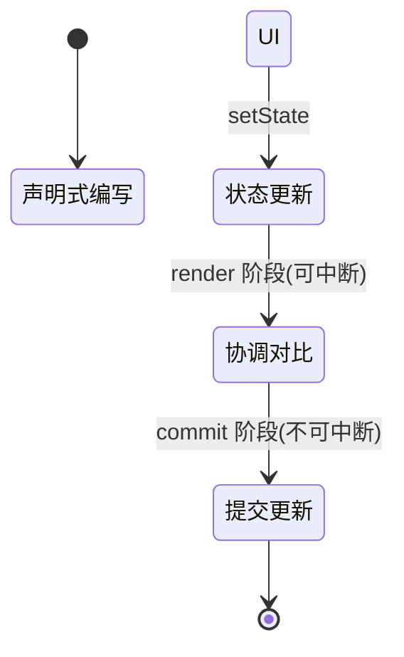

## 📖 引言

所有前端 UI 框架都在回答同一个问题：**状态变化后，如何高效地更新界面**。React 选择了"**声明式 + 不可变 + 虚拟 DOM**"的路径：你只需描述 UI *应当*长什么样（What），React 负责计算出如何到达那个样子（How）。

本文将从状态更新出发，拆解 React 从"一次 `setState`"到"页面刷新"的完整链路，并深入理解支撑它的 **Fiber 架构**与 **Hooks** 机制。

::github{repo="facebook/react"}

---

## 一、声明式 UI 与虚拟 DOM

### 1.1 UI 是状态的函数

React 的核心心智模型是：`UI = f(state)`。状态变化时，React 重新执行函数得到新的 UI 描述，再与上一次描述进行对比，只更新差异部分。

```jsx
function Greeting({ name }) {
	return <div>你好，{name}！</div>;
}
```

### 1.2 虚拟 DOM 解决了什么

- JSX 会被编译为 `React.createElement` 调用，生成一棵**虚拟 DOM**（描述界面的普通对象树）
- 真实 DOM 的读写代价高昂，虚拟 DOM 让 React 先在内存中"算清楚"最小的变更集，再一次性落到真实 DOM



---

## 二、Hooks：把状态"挂"进函数组件

### 2.1 基础用法：useState

```jsx
import { useState } from "react";

function Counter() {
	const [count, setCount] = useState(0);

	return (
		<button onClick={() => setCount((c) => c + 1)}>
			当前计数：{count}
		</button>
	);
}
```

`setCount` 触发一次"更新请求"：调度器入队 → 重新执行组件函数 → 生成新虚拟 DOM → 协调对比 → 提交更新。

### 2.2 派生值与副作用

- 派生值直接通过表达式计算即可，无需额外的状态（React 会自动在重渲染时重算）：

```jsx
const doubled = count * 2; // 每次渲染都是最新的
```

- 副作用用 `useEffect` 声明，依赖数组控制执行时机：

```jsx
useEffect(() => {
	document.title = `当前计数：${count}`;
}, [count]); // 仅当 count 变化时执行
```

### 2.3 Hooks 的"铁律"：调用顺序

Hooks 必须在组件**顶层**、以**固定顺序**调用。React 并不认识变量名，它是依靠**调用顺序**把每次渲染的状态"对号入座"地存进 fiber 节点上的链表。

> [!WARNING] 警告
> 不要在循环、条件分支或嵌套函数中调用 Hooks，否则会打乱调用顺序，导致状态错乱。这也是为什么 ESLint 插件 `react-hooks/rules-of-hooks` 会被强制开启的原因。

---

## 三、Fiber：可中断的渲染架构

React 15 及以前，更新一旦开始就会**递归地一口气渲染完**，遇到复杂列表很容易卡顿掉帧。**Fiber** 架构将渲染工作拆解为可独立调度的小单元（fiber 节点），从而支持**时间切片**与**优先级调度**。

### 3.1 渲染的两个阶段

- **render 阶段**：可中断。构建/更新 fiber 树，收集需要执行的副作用（即"算出要改什么"）
- **commit 阶段**：不可中断。一次性把副作用应用到真实 DOM（即"真的去改"）



### 3.2 Diff 的优化策略

完整地比较两棵树的复杂度是 $O(n^3)$，React 基于三个经验假设将其降为 **O(n)**：

1. **不同类型的元素**直接重建整棵子树
2. 同级列表通过 **key** 标识元素身份，复用可复用的节点
3. 组件的渲染结果可被**剪枝**（父组件不变则子组件不会重复协调）

### 3.3 优先级与并发

React 18+ 引入**并发特性**：低优先级的更新可以被高优先级更新打断。`startTransition` 让非紧急更新可被延迟：

```jsx
import { startTransition, useState } from "react";

const [query, setQuery] = useState("");
const [list, setList] = useState([]);

// 紧急更新：立即刷新输入框
setQuery(value);

// 非紧急更新：可延迟、可被打断
startTransition(() => {
	setList(filterItems(value));
});
```

> [!NOTE] 提示
> 并发渲染不是"并行执行"，而是"可中断后恢复"。它保证了紧急交互（如输入）始终获得优先响应，避免大列表过滤阻塞输入框。

---

## 四、对比：React vs Vue vs Svelte

| 框架 | 运行时体积 | 更新粒度 | 心智模型 |
| --- | --- | --- | --- |
| React | 较大（含调度器） | 组件级（re-render） | 函数式 + 不可变 |
| Vue | 较大（含 VDOM） | 组件级 + 部分细粒度 | 响应式 + 模板 |
| Svelte | 小 | 细粒度（精确到节点） | 编译时 + 命令式输出 |

### 4.1 React vs Vue

```jsx
// React：显式的状态更新函数
function Counter() {
	const [count, setCount] = useState(0);
	return <button onClick={() => setCount((c) => c + 1)}>{count}</button>;
}
```

```vue
<!-- Vue：响应式变量直接赋值 -->
<script setup>
import { ref } from "vue";
const count = ref(0);
</script>
<template>
	<button @click="count++">{{ count }}</button>
</template>
```

React 更强调**显式与不可变**（每次更新都产生新值），Vue 则提供**可变 + 自动追踪**的体验。

### 4.2 什么时候选 React

- 团队生态与人才储备要求高、需要庞大的组件库支撑
- 需要成熟的并发特性与跨端方案（React Native）
- 偏好"少魔法、纯 JS 函数式"的编码风格

> [!IMPORTANT] 重要
> React 的组件函数**每次渲染都会重新执行**。性能优化的关键不在于"少写代码"，而在于控制"哪些组件值得重渲染"——善用 `React.memo`、`useMemo`、`useCallback` 来剪枝不必要的渲染。

---

## 五、进阶：渲染时的数据获取与下一代 API

React 19 引入了 `use` 等新 Hooks，允许在渲染期间直接读取 Promise 或 Context，配合 **Server Components** 将数据获取下沉到服务端：

```jsx
import { use } from "react";

function Post({ postPromise }) {
	const post = use(postPromise); // 渲染期间读取数据
	return <article>{post.title}</article>;
}
```

配合 `<Suspense>` 即可实现按需加载与优雅的加载态，进一步简化数据流。

---

## 六、总结



React 的渲染核心可以概括为：

1. **声明式**：`UI = f(state)`，你只描述结果
2. **虚拟 DOM + Diff**：在内存中算出最小变更集
3. **Fiber + 调度**：可中断的渲染与优先级
4. **Hooks**：以调用顺序为锚，把状态挂进函数组件

理解这套渲染链路，不仅能帮你写出更高效的 React 代码，也能让你对现代前端框架的设计取舍有更深刻的认识。
