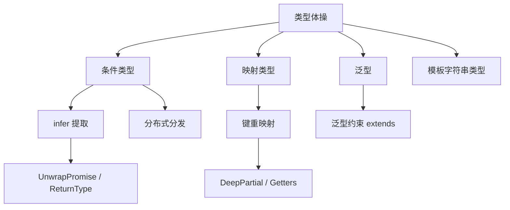

## 📖 引言

TypeScript 的类型系统远比普通意义上的"类型检查"要强大。通过**泛型**、**条件类型**、**映射类型**与 **infer** 等特性，我们可以在编译期对类型进行推导、变换与编程，这就是社区中常说的**类型体操**。

掌握类型体操不仅能写出更精确、更安全的类型声明，还能提升我们阅读和封装第三方库类型的能力。本文将从基础逐步深入，带大家领略类型编程的魅力。

> [!TIP] 建议
> 建议配合 TypeScript Playground（TS 官网）边看边写，实时查看类型推导结果，理解会更深刻。

---

## 一、泛型：类型编程的基石

泛型让我们可以在定义函数、接口或类时**不预先指定具体类型**，而是在使用时再确定。

### 1.1 泛型函数

```ts
function identity<T>(value: T): T {
	return value;
}

const num = identity<number>(42); // 显式指定
const str = identity("hello"); // 类型推断：string
```

### 1.2 泛型约束

通过 `extends` 关键字限制类型参数的范围：

```ts
interface HasLength {
	length: number;
}

function logLength<T extends HasLength>(value: T): void {
	console.log(value.length);
}

logLength([1, 2, 3]); // ✅ 数组有 length
logLength("abc"); // ✅ 字符串有 length
// logLength(42); // ❌ 数字没有 length，编译报错
```

---

## 二、条件类型：类型的分支逻辑

条件类型语法类似三元表达式：`T extends U ? X : Y`。

```ts
type IsArray<T> = T extends any[] ? true : false;

type A = IsArray<number[]>; // true
type B = IsArray<string>; // false
```

### 2.1 分布式条件类型

当条件类型作用于**裸类型参数**时，会对联合类型中的每个成员分别求值：

```ts
type ToArray<T> = T extends unknown ? T[] : never;

type Result = ToArray<string | number>; // string[] | number[]
```

这就是为什么很多工具类型（如 `Exclude`、`Extract`）能天然处理联合类型。

```ts
type MyExclude<T, U> = T extends U ? never : T;

type C = MyExclude<"a" | "b" | "c", "a">; // "b" | "c"
```

---

## 三、infer：从类型中"提取"信息

`infer` 关键字让我们在条件类型中**声明一个待推断的类型变量**，常用于从函数、数组、Promise 等结构中抽取内部类型。

### 3.1 提取函数返回值

```ts
type MyReturnType<T> = T extends (...args: any[]) => infer R ? R : never;

type Fn = (a: number, b: string) => boolean;
type R = MyReturnType<Fn>; // boolean
```

### 3.2 提取数组元素类型

```ts
type ElementOf<T> = T extends (infer E)[] ? E : never;

type Nums = ElementOf<number[]>; // number
type Mix = ElementOf<(string | boolean)[]>; // string | boolean
```

### 3.3 层层解包 Promise

```ts
type UnwrapPromise<T> = T extends Promise<infer U>
	? U extends Promise<unknown>
		? UnwrapPromise<U>
		: U
	: T;

type Deep = UnwrapPromise<Promise<Promise<string>>>; // string
```

> [!NOTE] 提示
> `infer` 只能出现在条件类型的 `extends` 分支中，且不能用于约束子句（`infer` in a constraint is not allowed）。

---

## 四、映射类型：批量改造对象结构

映射类型可以遍历对象的所有键并生成新的类型，是 `Readonly`、`Partial` 等工具类型的底层实现。

```ts
type MyReadonly<T> = {
	readonly [K in keyof T]: T[K];
};

type MyPartial<T> = {
	[K in keyof T]?: T[K];
};

interface User {
	id: number;
	name: string;
}

type ReadonlyUser = MyReadonly<User>;
// { readonly id: number; readonly name: string }
```

### 4.1 键重映射（TypeScript 4.1+）

结合 `as` 关键字可以在映射过程中**重命名键**，并配合模板字符串类型过滤：

```ts
type Getters<T> = {
	[K in keyof T as `get${Capitalize<string & K>}`]: () => T[K];
};

type UserGetters = Getters<User>;
// { getId: () => number; getName: () => string }
```

---

## 五、模板字符串类型：字符串的精确匹配

模板字符串类型让字符串也能成为"字面量联合"，常用于路由、事件名等场景：

```ts
type EventName = `on${"Click" | "Change"}`;
// "onClick" | "onChange"

type Route = `/user/${string}`;
const r1: Route = "/user/123"; // ✅
// const r2: Route = "/admin/123"; // ❌
```

---

## 六、综合实战：实现一个 DeepPartial

将以上知识点串联起来，实现经典的类型体操题目 `DeepPartial`——递归地将对象的所有属性（含嵌套对象）变为可选：

```ts
type DeepPartial<T> = {
	[K in keyof T]?: T[K] extends object ? DeepPartial<T[K]> : T[K];
};

interface Config {
	server: {
		host: string;
		port: number;
		auth: { token: string };
	};
	debug: boolean;
}

type PartialConfig = DeepPartial<Config>;
// 每一层属性都变成可选，嵌套对象也递归处理
```

`DeepPartial` 在编写配置合并、Mock 数据等场景中非常实用。

---

## 七、工具类型速查表

| 工具类型 | 作用 | 示例结果 |
| --- | --- | --- |
| `Partial<T>` | 所有属性可选 | `Partial<User>` |
| `Required<T>` | 所有属性必填 | `Required<User>` |
| `Readonly<T>` | 所有属性只读 | `Readonly<User>` |
| `Pick<T, K>` | 挑选部分属性 | `Pick<User, "id">` |
| `Omit<T, K>` | 剔除部分属性 | `Omit<User, "name">` |
| `Exclude<T, U>` | 从联合类型中排除 | `Exclude<"a"\|"b", "a">` → `"b"` |
| `Extract<T, U>` | 从联合类型中提取 | `Extract<"a"\|"b", "a">` → `"a"` |
| `ReturnType<T>` | 提取函数返回类型 | `ReturnType<typeof fn>` |
| `Parameters<T>` | 提取函数参数元组 | `Parameters<typeof fn>` |

---

## 八、总结



类型体操的核心思想可以概括为：

1. **泛型**提供"参数化"能力
2. **条件类型**提供"分支判断"
3. **infer**提供"模式提取"
4. **映射类型**提供"结构变换"

> [!WARNING] 注意
> 类型体操并非越复杂越好。在实际项目中，优先使用简洁、可读的类型；只有确实需要时才引入高级技巧，并在注释中说明意图，避免过度设计导致维护困难。

希望本文能帮你打开 TypeScript 类型编程的大门，在实际项目中写出更优雅的类型！
